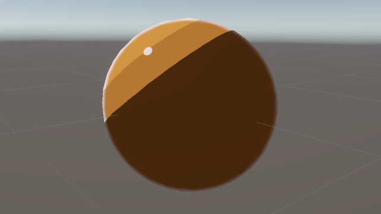

# Unity ShaderLab

This repository contains my personal Unity ShaderLab / HLSL experiments.

It serves as both a learning journal and a growing collection of shaders as I study computer graphics fundamentals. 

I'm so interested at non photo-realistic rendering. So these shaders will be related with NPR.

## Shaders

### Toon Shader

